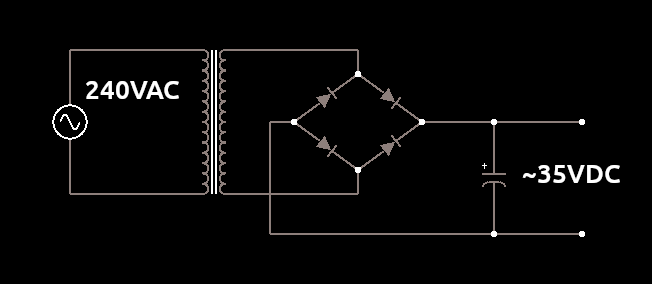
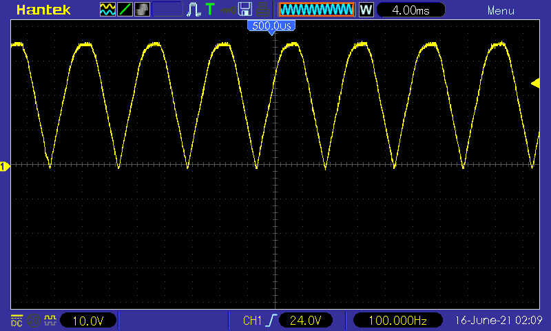
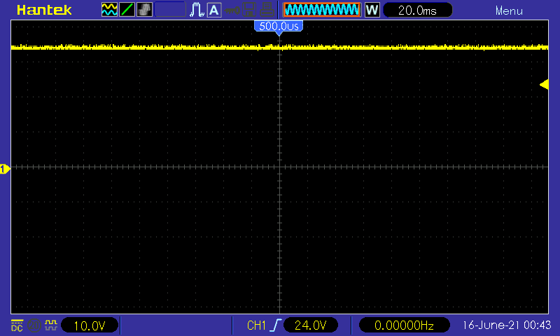
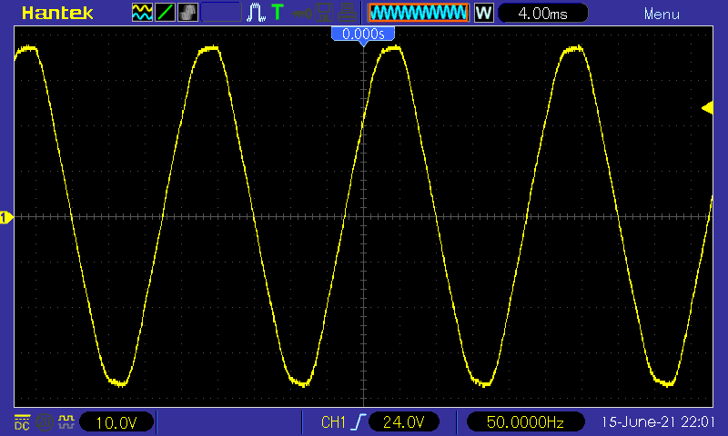

# AC-DC Conversion
A circuit to convert mains AC to relatively low voltage DC.

## Details
A 50VA step-down transformer is connected to 240VAC mains on the primary, resulting in reduced voltage on the secondary
with a peak voltage of around 35V.
The secondary is connected to a full bridge rectifier which has a smoothing capacitor on the output resulting
in ~35VDC.
